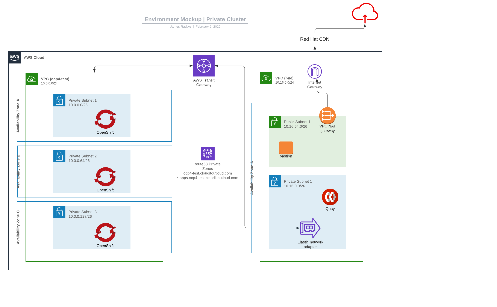

# clouditoutloud.com
Install OpenShift Container Platform as a Private Cluster on AWS

## Overview

For a "AWS private cluster" installation, we (now) need to create:

Cluster Resources:

* Subnets
* Route tables
* VPCs
* VPC DHCP options
* VPC endpoints

Bastion and Egress (bne) Resources:

* Internet gateways
* NAT gateways

Additionally, we will need an EC2 instance to run as a bastion (since a remote bastion cannot access the resources as there will be no publicly accessible endpoints.

## Notes
We will use a /24 (initially) for the OCP4 VPC CIDR and 3 AZs (1 Private Subnet per AZ)  
and a /24 for the BnE VPC CIDR with 1 AZ (1 Public, 1 Private)

## References
https://docs.openshift.com/container-platform/4.9/installing/installing_aws/installing-aws-private.html
https://docs.aws.amazon.com/vpc/latest/tgw/transit-gateway-nat-igw.html
